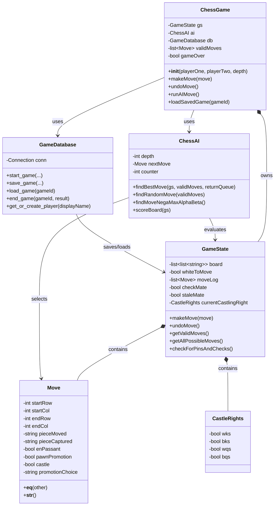

# Chess Engine Class Diagram

```mermaid
classDiagram
    class ChessGame {
        -GameState gs
        -ChessAI ai
        -GameDatabase db
        -list~Move~ validMoves
        -bool gameOver
        +__init__(playerOne, playerTwo, depth)
        +makeMove(move)
        +undoMove()
        +runAIMove()
        +loadSavedGame(gameId)
    }

    class GameState {
        -list~list~string~~ board
        -bool whiteToMove
        -list~Move~ moveLog
        -bool checkMate
        -bool staleMate
        -CastleRights currentCastlingRight
        +makeMove(move)
        +undoMove()
        +getValidMoves()
        +getAllPossibleMoves()
        +checkForPinsAndChecks()
    }

    class Move {
        -int startRow
        -int startCol
        -int endRow
        -int endCol
        -string pieceMoved
        -string pieceCaptured
        -bool enPassant
        -bool pawnPromotion
        -bool castle
        -string promotionChoice
        +__eq__(other)
        +__str__()
    }

    class CastleRights {
        -bool wks
        -bool bks
        -bool wqs
        -bool bqs
    }

    class ChessAI {
        -int depth
        -Move nextMove
        -int counter
        +findBestMove(gs, validMoves, returnQueue)
        +findRandomMove(validMoves)
        +findMoveNegaMaxAlphaBeta()
        +scoreBoard(gs)
    }

    class GameDatabase {
        -Connection conn
        +start_game(...)
        +save_game(...)
        +load_game(gameId)
        +end_game(gameId, result)
        +get_or_create_player(displayName)
    }

    ChessGame *-- GameState : owns
    ChessGame --> ChessAI : uses
    ChessGame --> GameDatabase : uses
    GameState *-- Move : contains
    GameState *-- CastleRights : contains
    ChessAI --> GameState : evaluates
    ChessAI --> Move : selects
    GameDatabase --> GameState : saves/loads
```
