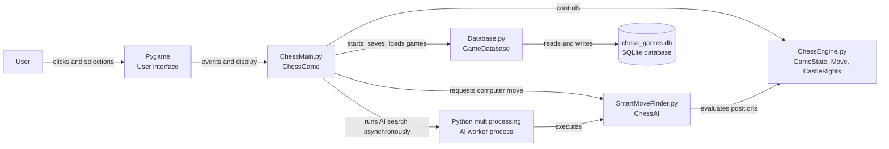

# Chess Engine Component Diagram

```mermaid
flowchart LR
    user[User]
    main["ChessMain.py<br/>ChessGame"]
    engine["ChessEngine.py<br/>GameState, Move, CastleRights"]
    ai["SmartMoveFinder.py<br/>ChessAI"]
    database["Database.py<br/>GameDatabase"]
    sqlite[("chess_games.db<br/>SQLite database")]
    pygame["Pygame<br/>User interface"]
    multiprocessing["Python multiprocessing<br/>AI worker process"]

    user -->|clicks and selections| pygame
    pygame -->|events and display| main
    main -->|controls| engine
    main -->|requests computer move| ai
    ai -->|evaluates positions| engine
    main -->|starts, saves, loads games| database
    database -->|reads and writes| sqlite
    main -->|runs AI search asynchronously| multiprocessing
    multiprocessing -->|executes| ai
```

