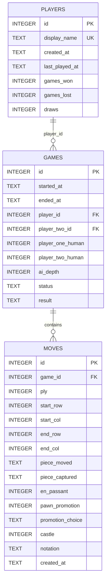

# Chess Engine Database Schema

```mermaid
erDiagram
    PLAYERS ||--o{ GAMES : "player_id"
    GAMES ||--o{ MOVES : contains

    PLAYERS {
        INTEGER id PK
        TEXT display_name UK
        TEXT created_at
        TEXT last_played_at
        INTEGER games_won
        INTEGER games_lost
        INTEGER draws
    }

    GAMES {
        INTEGER id PK
        TEXT started_at
        TEXT ended_at
        INTEGER player_id FK
        INTEGER player_two_id FK
        INTEGER player_one_human
        INTEGER player_two_human
        INTEGER ai_depth
        TEXT status
        TEXT result
    }

    MOVES {
        INTEGER id PK
        INTEGER game_id FK
        INTEGER ply
        INTEGER start_row
        INTEGER start_col
        INTEGER end_row
        INTEGER end_col
        TEXT piece_moved
        TEXT piece_captured
        INTEGER en_passant
        INTEGER pawn_promotion
        TEXT promotion_choice
        INTEGER castle
        TEXT notation
        TEXT created_at
    }
```
