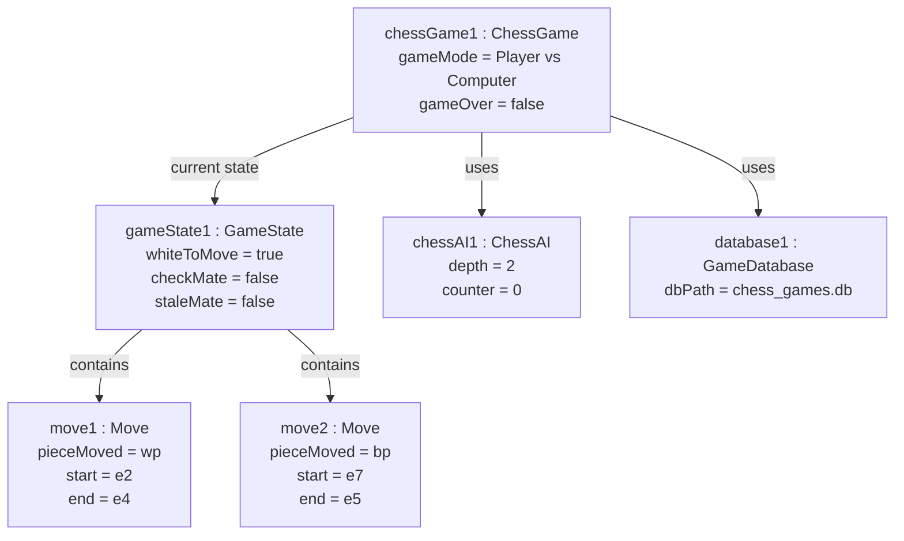

# Chess Engine Object Diagram

```mermaid
flowchart TD
    chessGame1["chessGame1 : ChessGame<br/>gameMode = Player vs Computer<br/>gameOver = false"]
    gameState1["gameState1 : GameState<br/>whiteToMove = true<br/>checkMate = false<br/>staleMate = false"]
    move1["move1 : Move<br/>pieceMoved = wp<br/>start = e2<br/>end = e4"]
    move2["move2 : Move<br/>pieceMoved = bp<br/>start = e7<br/>end = e5"]
    chessAI1["chessAI1 : ChessAI<br/>depth = 2<br/>counter = 0"]
    database1["database1 : GameDatabase<br/>dbPath = chess_games.db"]

    chessGame1 -->|current state| gameState1
    chessGame1 -->|uses| chessAI1
    chessGame1 -->|uses| database1
    gameState1 -->|contains| move1
    gameState1 -->|contains| move2
```
